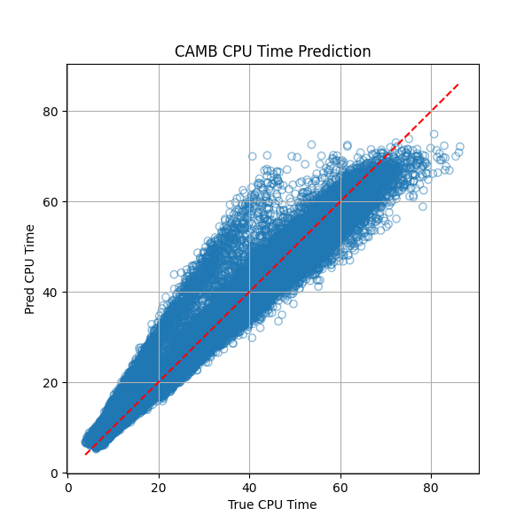
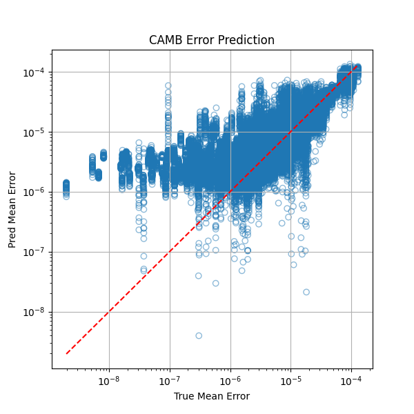
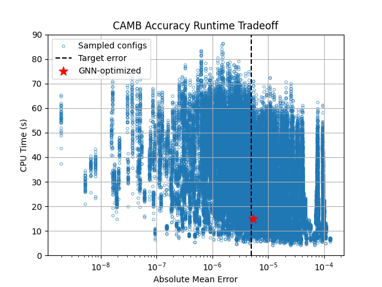

# GNN-Based Framework for Predicting Optimal Accuracy Parameters in Analysis Pipelines

## Project Overview

This project presents a general framework for **learning and optimizing non-scientific accuracy parameters** in computational analysis pipelines.  
Given a user-specified accuracy target, the framework predicts parameter configurations that **minimize computational cost** while satisfying accuracy constraints.

Although demonstrated on cosmology modules, the framework is **domain-agnostic** and applicable to any scientific or numerical module with tunable accuracy–performance parameters.

The project currently includes:
- Matter power spectrum solvers: **CAMB**, **CLASS**
- MCMC sampler: **EMCEE** (tested on a 6D synthetic Gaussian)

For each module, the framework:
1. Learns a surrogate mapping  
   **accuracy parameters → (error, CPU time)** using a Graph Neural Network (GNN)
2. Evaluates prediction performance
3. Performs **inverse design** to identify accuracy parameters that achieve a desired error with minimal runtime

---

## Key Features

- **Graph-based dataset construction**  
  k-nearest-neighbor graphs capture local structure in parameter space.

- **GNN surrogate modeling**  
  A Graph Convolutional Network (GCN) learns the joint behavior of numerical error and runtime.

- **Model evaluation utilities**  
  Standard regression metrics and diagnostic plots validate prediction quality.

- **Inverse-design optimization**  
  Given a target error, the trained surrogate identifies accuracy parameters that minimize CPU time.

- **Modular and extensible design**  
  Works for any pipeline component with tunable non-scientific parameters.

---

## Results and Demonstration

### Surrogate Model Performance

The trained GNN accurately predicts both CPU runtime and numerical error for unseen configurations.

**CPU Time Prediction (CAMB)**  
*Predicted vs. true CPU runtime. The dashed line indicates perfect agreement.*

**Error Prediction (CAMB)**  
*Predicted vs. true numerical error.*

These results demonstrate that the GNN learns a reliable surrogate for the solver’s accuracy–runtime behavior.

---

### Accuracy–Runtime Trade-off and Inverse Design

The figure below shows the **accuracy–runtime trade-off landscape** for CAMB across sampled accuracy configurations.

- Blue points represent sampled solver configurations  
- The dashed vertical line marks a **user-specified target error**
- The red star indicates the **GNN-optimized configuration**

Using the trained surrogate, the framework identifies parameter settings that satisfy the target accuracy while reducing computational cost, demonstrating practical inverse-design capability.

---

## Project Structure

ai-optimized-pipeline
├── ai-pipeline-env.yml
├── Data
│   ├── gnn_camb_dataset.csv
│   ├── gnn_class_dataset.csv
│   ├── gnn_emcee_dataset.csv
│   └── std-camb-data.csv
├── figures
│   ├── camb-cpu.png
│   ├── camb-error.png
│   └── camb-Error-vs-CPU.png
├── gnn_utils
│   ├── gnn_model_utils.py
│   ├── gnn_train.py
│   └── inverse_design_utils.py
├── install.txt
├── notebooks
│   ├── gnn_model_eval.ipynb
│   ├── gnn_train.ipynb
│   ├── make_dataset_gnn.ipynb
│   ├── pipeline_test.ipynb
│   └── predict_optimum_pars.ipynb
├── pipeline
│   ├── engine.py
│   ├── functions.py
│   └── modules.py
└── README.md

---

## Pipeline Framework

The `pipeline/` module provides a unified interface for integrating scientific codes into a common evaluation framework.  
It supports:

- standardized parameter sweeps  
- runtime and error measurement  
- parallel execution  
- easy extension to new modules  

### engine.py
Defines the core abstraction for pipeline modules and manages execution, timing, and comparison.

### functions.py
Implements the scientific computations (CAMB, CLASS, EMCEE) and corresponding comparison functions.

### modules.py
Provides lightweight wrappers so each module plugs directly into the pipeline interface.

---

## Summary

This project demonstrates how **graph-based surrogate models** can be used to learn accuracy–cost trade-offs in scientific software and enable **data-driven inverse design** of solver parameters.  
The framework is modular, extensible, and applicable to a wide range of numerical analysis pipelines.

---

## Future Work

- Validation of optimized configurations with direct solver runs  
- Extension to additional scientific modules  
- Multi-objective optimization (accuracy, runtime, memory)

